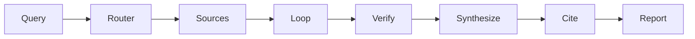

## Architecture

This project is built as a **multi-stage agent workflow**. Each stage emits **structured JSON** that becomes input to later stages. That design keeps state handoffs explicit and testable.

### Workflow graph



### Stages and responsibilities

- **Router** (`src/research_assistant/agents/router.py`)
  - Classifies the query and recommends strategy knobs (domain, complexity, preferred sources).
- **Sources** (`src/research_assistant/agents/sources.py`)
  - Fan-out: multiple workers generate structured candidate sources in parallel.
  - Fan-in: a deterministic aggregator merges, de-dupes, and ranks sources.
- **Refinement loop** (`src/research_assistant/agents/refinement.py`)
  - A draft agent produces an answer grounded in sources.
  - A critic agent scores quality and provides actionable feedback.
  - A LoopAgent can stop early once a threshold is met.
- **Verification** (`src/research_assistant/agents/validation.py`)
  - Flags questionable claims and assigns a credibility score.
- **Synthesis** (`src/research_assistant/agents/synthesis.py`)
  - Produces an executive summary and coherent narrative.
- **Citations** (`src/research_assistant/agents/citations.py`)
  - Formats citations and includes deterministic fallbacks when the model output is low quality.
- **Reporting** (`src/research_assistant/reporting/markdown.py`)
  - Renders a Markdown report and a lightweight metrics summary.

### State flow (data handoff)

The most important invariant is that **sources flow into refinement**, not just into later stages:

```text
sources.top_sources -> refinement_loop input -> fact_check / synthesis
```

This prevents the system from generating answers that ignore the evidence it just gathered.

### Runtime notes

Agents are executed via the official ADK `Runner`, capturing event streams and extracting the final structured payload from each stage.

